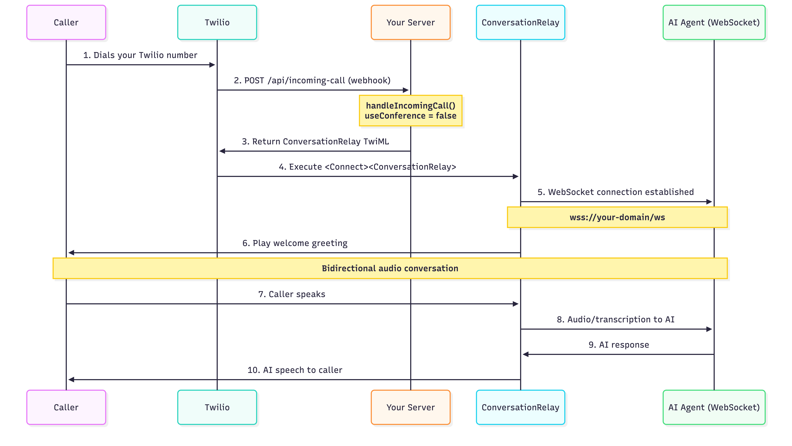
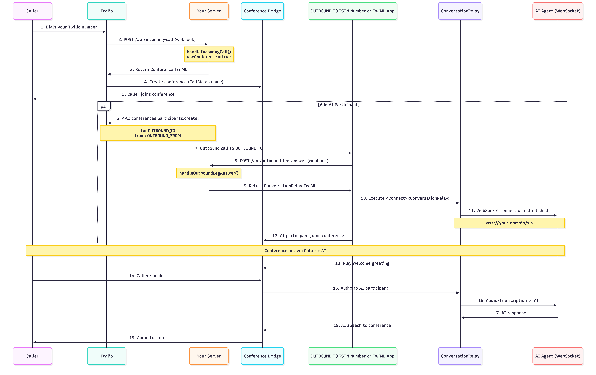

# Conference Mode Flow Documentation

This document explains the differences between the two modes of operation for handling incoming calls with ConversationRelay.

## Configuration

The mode is controlled by the `USE_CONFERENCE` environment variable in your `.env` file:

```env
USE_CONFERENCE=false  # Direct ConversationRelay (default)
USE_CONFERENCE=true   # Conference mode with outbound participant
```

---

## USE_CONFERENCE=false (Direct Mode)

### Flow Diagram



### Description

1. **Incoming call received** - Caller dials your Twilio number
2. **Webhook triggered** - Twilio calls `/api/incoming-call` endpoint
3. **Direct ConversationRelay** - Server immediately returns ConversationRelay TwiML
4. **AI connection** - ConversationRelay establishes WebSocket connection to your AI service
5. **Conversation** - Caller speaks directly with the AI agent

### TwiML Response

```xml
<?xml version="1.0" encoding="UTF-8"?>
<Response>
  <Connect>
    <ConversationRelay url="wss://your-domain/ws"
                       voice="Polly.Amy-Neural"
                       language="en-US"
                       welcomeGreeting="Thanks for calling..." />
  </Connect>
</Response>
```

### Advantages

- **Simpler setup** - No additional phone numbers required
- **Lower latency** - Direct connection to AI
- **Fewer resources** - No conference bridge needed
- **Lower cost** - Only one call leg

### Use Cases

- Simple AI assistant applications
- Direct customer support bots
- IVR replacement systems
- Any scenario where only the caller needs to speak with the AI

---

## USE_CONFERENCE=true (Conference Mode)

### Flow Diagram



### Description

1. **Incoming call received** - Caller dials your Twilio number
2. **Conference created** - Server returns TwiML to place caller in conference
3. **Caller joins conference** - Caller is placed in a conference bridge (named by CallSid)
4. **Participant added** - Server calls Twilio API to add a participant:
   - `to`: `OUTBOUND_TO` (can be a TwiML App SID like `app:APxxxx` or a phone number)
   - `from`: `OUTBOUND_FROM` (caller ID for the outbound call, required for PSTN numbers)
5. **Outbound leg answers** - Depending on the `to` parameter:
   - **TwiML App**: Twilio invokes the app's Voice URL which should point to `/api/outbound-leg-answer`
   - **Phone number**: The number answers and should be configured to call `/api/outbound-leg-answer`
6. **AI connection** - The outbound leg webhook returns ConversationRelay TwiML
7. **Conference active** - Both caller and AI agent are in the same conference

### TwiML Response (Incoming Call)

```xml
<?xml version="1.0" encoding="UTF-8"?>
<Response>
  <Dial>
    <Conference startConferenceOnEnter="true"
                endConferenceOnExit="true">
      CAxxxxxxxxxxxxxxxxxxxxxxxxxxxx
    </Conference>
  </Dial>
</Response>
```

### TwiML Response (Outbound Leg)

```xml
<?xml version="1.0" encoding="UTF-8"?>
<Response>
  <Connect>
    <ConversationRelay url="wss://your-domain/ws"
                       voice="Polly.Amy-Neural"
                       language="en-US"
                       welcomeGreeting="Thanks for calling..." />
  </Connect>
</Response>
```

### Requirements

When `USE_CONFERENCE=true`, you **must** configure:

```env
# Option 1: Using TwiML App (recommended - no PSTN charges for outbound leg)
OUTBOUND_TO=app:APxxxxxxxxxxxxxxxxxxxxxxxxxxxx  # TwiML App SID
OUTBOUND_FROM=+1987654321                       # From number (caller ID)

# Option 2: Using PSTN number
OUTBOUND_TO=+1234567890    # Twilio number that returns ConversationRelay TwiML
OUTBOUND_FROM=+1987654321  # Caller ID for outbound call
```

#### TwiML App Setup (Option 1)

When using a TwiML App, configure the app's Voice URL to point to your server's `/api/outbound-leg-answer` endpoint:

- Voice URL: `https://your-domain/api/outbound-leg-answer`
- Voice Method: `POST`

This approach is recommended because:

- No PSTN charges for the outbound leg
- Simpler configuration (no need for a separate phone number)
- Faster connection (no dialing delay)

#### PSTN Number Setup (Option 2)

When using a phone number, configure the Twilio number to call your server's `/api/outbound-leg-answer` endpoint when it receives a call.

### Advantages

- **Multi-party support** - Can add multiple participants (humans or AI agents)
- **Call recording** - Can record entire conference
- **Hold/transfer** - Can implement hold music, call transfer
- **Monitoring** - Can add supervisor/monitor participants
- **Advanced features** - Access to conference-specific features (mute, kick, etc.)
- **Cost optimization** - Using TwiML App for the AI participant eliminates PSTN charges for the outbound leg

### Use Cases

- Multi-party conversations (customer + AI + human agent)
- Call center scenarios with AI assist
- Training/monitoring scenarios (supervisor listening)
- Complex call routing and transfer scenarios
- When you need conference recording capabilities

---

## Key Differences Summary

| Aspect               | Direct Mode (false) | Conference Mode (true)                                |
| -------------------- | ------------------- | ----------------------------------------------------- |
| **Setup Complexity** | Simple              | More complex                                          |
| **Required Config**  | None additional     | `OUTBOUND_TO`, `OUTBOUND_FROM`                        |
| **Call Legs**        | 1 (inbound)         | 2 (inbound + outbound)                                |
| **Latency**          | Lower               | Slightly higher                                       |
| **Cost**             | Lower (1 call leg)  | Higher (conference + PSTN leg if not using TwiML App) |
| **Multi-party**      | No                  | Yes                                                   |
| **Hold/Transfer**    | Limited             | Full support                                          |
| **Monitoring**       | No                  | Can add supervisor                                    |

---

## Choosing the Right Mode

### Use Direct Mode (false) when:

- You have a simple AI assistant use case
- Only the caller needs to speak with AI
- You want the lowest latency and cost
- You don't need multi-party features

### Use Conference Mode (true) when:

- You need to add human agents to calls
- You want conference recording capabilities
- You need hold, transfer, or monitoring features
- You need to dynamically add/remove participants

---

## Implementation Files

### Direct Mode

- `src/controllers/callController.ts:23-24` - Returns ConversationRelay TwiML directly
- `src/helpers/conversationRelayHelper.ts` - Creates ConversationRelay TwiML

### Conference Mode

- `src/controllers/callController.ts:26-62` - Creates conference and adds participant (line 49 uses TwiML App dial)
- `src/controllers/outboundLegController.ts` - Handles outbound leg answer
- `src/routes/outboundLegRoutes.ts` - Route for outbound leg webhook (`/api/outbound-leg-answer`)

### Configuration

- `src/config.ts` - Environment variable validation and configuration
- `.env` - Set `USE_CONFERENCE` and related variables

### Note on Current Implementation

The current implementation in `src/controllers/callController.ts:49` uses TwiML App dialing:

```typescript
to: `app:AP804756aa4fb6c350a3f1feb1dcfc4be8`;
```

To use PSTN numbers instead, change the `to` parameter to use the `OUTBOUND_TO` environment variable directly:

```typescript
to: outboundTo; // Will use the value from config.twilio.outboundTo
```
