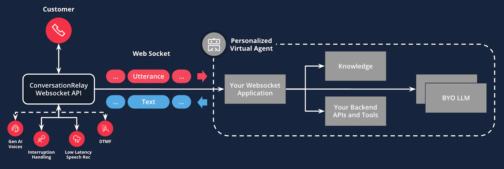

# Twilio ConversationRelay

## Disclaimer

This software is to be considered "sample code", a Type B Deliverable, and is delivered "as-is" to the user. Twilio bears no responsibility to support the use or implementation of this software.

## Overview

A Twilio ConversationRelay project for building a Voice AI Assistant.



## Features

- REST API endpoint for incoming calls
- WebSocket real-time communication
- Uses OpenAI model and ChatCompletion API in `LLMService`
  - Supports both streaming and non-streaming responses
- Jest for unit testing

## Prerequisites

- Node.js (v20+)
- npm

Before using this project, please follow the setup instructions in [SETUP.md](./SETUP.md).

## Getting Started

1. Clone this repository

2. Navigate to the project directory:
   ```sh
   cd twilio-conversation-relay-sample
   ```
3. Install dependencies:
   ```sh
   npm install
   ```
4. Copy the sample environment file and configure the environment variables:
   ```sh
   cp .env.sample .env
   ```

Once created, open `.env` in your code editor. You are required to set the following environment variables for the app to function properly:

### Required Variables
| Variable Name | Description | Example Value |
|-------------------|--------------------------------------------------|------------------------|
| `TWILIO_ACCOUNT_SID` | Your Twilio Account SID from the Twilio Console | `ACXXXXXXXXXXXXXXXXXXXXXXXXXXXXXXXX` |
| `TWILIO_AUTH_TOKEN` | Your Twilio Auth Token from the Twilio Console | `xxxxxxxxxxxxxxxxxxxxxxxxxxxxxxxx` |
| `TWILIO_WORKFLOW_SID` | The Taskrouter Workflow SID for enqueuing calls with Flex agents. Found in: TaskRouter > Workspaces > Flex Task Assignment > Workflows | `WWXXXXXXXXXXXXXXXXXXXXXXXXXXXXXXXX` |
| `NGROK_DOMAIN` | The forwarding URL of your ngrok tunnel | `your-domain.ngrok.dev` |
| `LLM_PROVIDER` | LLM provider to use: `openai`, `anthropic`, `google`, or `azure-openai` | `openai` |
| API Key (provider-specific) | **OpenAI**: `OPENAI_API_KEY`<br>**Anthropic**: `ANTHROPIC_API_KEY`<br>**Google**: `GOOGLE_API_KEY`<br>**Azure OpenAI**: `AZURE_OPENAI_API_KEY` | `sk-xxxxxxxxxxxxxxxxxxxxxxxxxxxxxx` |

### Optional Variables
| Variable Name | Description | Default Value |
|-------------------|--------------------------------------------------|------------------------|
| `PORT` | The port your local server runs on | `3000` |
| `TWILIO_PHONE_NUMBER` | Your Twilio phone number for outbound calls (can be passed in API request) | - |
| `TWILIO_CONVERSATIONAL_INTELLIGENCE_SERVICE` | Twilio Conversational Intelligence Service SID | - |
| `WELCOME_GREETING` | The message automatically played to the caller | `"Thanks for calling. How can I help you today?"` |
| `LLM_MODEL_NAME` | Model name override (uses provider defaults if not set)<br>• OpenAI: `gpt-3.5-turbo`<br>• Anthropic: `claude-haiku-4-5-20251001`<br>• Google: `gemini-2.0-flash-001`<br>• Azure OpenAI: Your deployment name | Provider default |
| `LLM_TEMPERATURE` | LLM temperature setting | `0.9` |
| `LLM_MAX_TOKENS` | LLM max tokens | `1000` |
| `AZURE_OPENAI_API_INSTANCE_NAME` | Azure OpenAI instance name (required if using azure-openai) | `your-instance-name` |
| `AZURE_OPENAI_API_DEPLOYMENT_NAME` | Azure OpenAI deployment name (required if using azure-openai) | `your-deployment-name` |
| `AZURE_OPENAI_API_VERSION` | Azure OpenAI API version | `2024-02-15-preview` |

5. In the Twilio Console, go to Phone Numbers > Manage > Active Numbers and select an existing phone number (or Buy a number). In your Phone Number configuration settings, update the first A call comes in dropdown to Webhook and set the URL to https://[your-ngrok-domain].ngrok.app/api/incoming-call, ensure HTTP is set to HTTP POST, and click Save configuration.

### Run the app

Once dependencies are installed, `.env` is set up, and Twilio is configured properly, run the dev server with the following command:

```
npm run dev
```

### Testing the app

With the development server running, you can now begin testing the Voice AI Assistant. Place a call to the configured phone number and start interacting with your AI Assistant

## Scripts

- `npm run dev`: Start the development server
- `npm run build`: Compile TypeScript
- `npm start`: Run the production build
- `npm test`: Run unit tests

## API Endpoints

- `POST /api/incoming-call`: Process incoming call - Initiates ConversationRelay (see [src/routes/callRoutes.ts](src/routes/callRoutes.ts))
- `POST /api/action`: Handle connect action - Human agent handoff (see [src/routes/connectActionRoutes.ts](src/routes/connectActionRoutes.ts))
- `POST /api/outbound-call`: Initiate outbound call - Schedules callback with AI Assistant (see [src/routes/outboundCallRoutes.ts](src/routes/outboundCallRoutes.ts))

### Outbound Call Example

```bash
curl -X POST http://localhost:3000/api/outbound-call \
  -H "Content-Type: application/json" \
  -d '{
        "to": "+1443xxxxxxx",
        "clientName": "Memorial Hospital",
        "firstName": "John",
        "date": "April 25th, 2026",
        "startTime": "7 AM",
        "endTime": "3 PM",
        "occupation": "Registered Nurse",
        "from": "+1443xxxxxxx"
      }'
```

## WebSocket

- Real-time communication setup (see [src/services/llm/websocketService.ts](src/services/llm/websocketService.ts))

## Configuration

- Environment variables are loaded from the `.env` file (see [src/config.ts](src/config.ts))

## Controllers

- `handleIncomingCall`: Processes incoming call (see [src/controllers/callController.ts](src/controllers/callController.ts))
- `handleConnectAction`: Handles connect action (see [src/controllers/connectActionController.ts](src/controllers/connectActionController.ts))
- `initiateOutboundCall`: Initiates outbound call for scheduling callbacks (see [src/controllers/outboundCallController.ts](src/controllers/outboundCallController.ts))

## LLM Services

- `LLMService`: Manages interactions with the language model (see [src/services/llm/llmService.ts](src/services/llm/llmService.ts))

### Tools

- `humanAgentHandoff`: Handles handoff to a human agent (see [src/services/llm/tools/humanAgentHandoff.ts](src/services/llm/tools/humanAgentHandoff.ts))
- `switchLanguage`: Switches conversation language (see [src/services/llm/tools/switchLanguage.ts](src/services/llm/tools/switchLanguage.ts))
- `confirmShiftBid`: Confirms shift bid and generates confirmation ID (see [src/services/llm/tools/confirmShiftBid.ts](src/services/llm/tools/confirmShiftBid.ts))
- `endCall`: Ends the call with a farewell message (see [src/services/llm/tools/endCall.ts](src/services/llm/tools/endCall.ts))

## License

This project is licensed under the MIT License.
